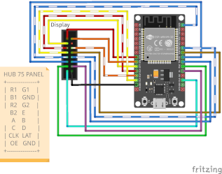

# Clockwizer

A fork of [Clockwise](https://github.com/jnthas/clockwise) by Jonathas Barbosa (@jnthas): a smart clock for a HUB75 LED matrix driven by an ESP32. Clockwizer keeps everything that makes Clockwise fun and adds a bunch of things on top.

**What's different from upstream**
- New clockfaces: **Football** (live scores, results, goal celebrations), and **Formula 1** (live sessions, standings, next race); **Tetris** also runs on 64x32 panels, with a ticker row that shows football scores and, if you switch it on, the F1 race
- A redesigned web settings page: pick the clockface, colours, brightness, update behaviour and more from your phone
- Automatic firmware updates: the clock checks for a new build every hour and rolls back by itself if the new one can't reach the update server
- The firmware location is a setting, so you can host your own builds
- Several clocks on one network list each other on the settings page

All the clockfaces from upstream are still here (Mario, Time in Words, World Map, Castlevania, Pacman, Pokemon and Tetris). **Luigi** is new: Mario in other colours. **Pacman** and **Pokemon** have been updated, and Tetris now also runs on 64x32 panels. Thanks to everyone who made them; credits are in the clockface folders and the [LICENSE](LICENSE) (MIT).

## What you need

- A HUB75/HUB75E compatible LED matrix, 64x64 (64x32 works with the Tetris face)
- An ESP32
- A power supply of 3A or more

Wire the matrix to the ESP32 as described by the [ESP32-HUB75-MatrixPanel-I2S-DMA](https://github.com/mrfaptastic/ESP32-HUB75-MatrixPanel-I2S-DMA#2-wiring-esp32-with-the-led-matrix-panel) library, which Clockwise uses. The default connections are shown below (diagram from upstream Clockwise).

[](docs/images/display_esp32_wiring_bb.png)

Ready-made options: Brian Lough's [ESP32 Trinity](https://github.com/witnessmenow/ESP32-Trinity) (just plug in the board), [Alexvanheu's PCB](https://github.com/Alexvanheu/Mario-Clock-PCB-ESP32) or hallard's [ESP32 D1 Mini matrix shield](https://github.com/hallard/WeMos-Matrix-Shield-DMA). The `3d-files/` folder has frame parts for printing around a 64x64 P3 panel.

## Getting started

1. **Flash a clockface** onto the ESP32 over USB, see [Installing](#installing) below.
2. **Connect it to WiFi.** On first boot the clock opens its own network called `Clockwise-Wifi` and shows a QR code. Scan it, or join that network, pick your WiFi (it must be 2.4 GHz) and enter the password. You can also set up WiFi while flashing from the browser, via the Improv step.
3. **Open the settings page.** For a few seconds after every start the clock shows a QR code that opens it. Or browse to `http://clockwise.local` or to the clock's IP address.
4. Choose your timezone, and you're done. The clock gets the time over NTP.

## Installing

### From source (PlatformIO)

The firmware is a [PlatformIO](https://platformio.org) project in `firmware/`. Every clockface is an environment named after its id:

```
cd firmware
pio run -e cw-cf-0x05 -t upload     # Pacman
```

| Id | Clockface | Panel |
|----|-----------|-------|
| `cw-cf-0x0B` | Football | 64x64 |
| `cw-cf-0x0C` | Formula 1 | 64x64 |
| `cw-cf-0x08` | Tetris (on 64x32 with a football and F1 ticker) | 64x64 and 64x32 |
| `cw-cf-0x01` | Mario | 64x64 |
| `cw-cf-0x09` | Luigi (Mario in other colours) | 64x64 |
| `cw-cf-0x05` | Pacman | 64x64 |
| `cw-cf-0x06` | Pokemon | 64x64 |
| `cw-cf-0x04` | Castlevania | 64x64 |
| `cw-cf-0x03` | World Map | 64x64 |
| `cw-cf-0x02` | Time in Words | 64x64 |

The clockface folders are in `firmware/clockfaces/`, shared code in `firmware/lib/`, and the entry point is `firmware/src/main.cpp`. Panels with a different wiring or orientation need a few settings that have no button on the web page, see [Advanced settings](#advanced-settings).

### Web flasher

No tools needed: open **https://vandalon.github.io/clockwizer/** in Chrome or Edge on a computer, plug in the ESP32, pick a clockface and press *Connect and install*. It writes the whole flash, so it also works for a blank ESP32 or for moving an older Clockwise to this firmware, and it offers to set up WiFi when it's done. The page and its libraries are hosted in this repository (`docs/`), and published together with the firmware by `update-fw.sh -g`.

## The Football clockface

The Football face turns the clock into a small scoreboard. With nothing on it is a clock on flip tiles with a rolling ball. When a match you follow is on, it switches to a live view with the score, the time played, a timeline with goals and cards, and the other results of the day. A goal plays a full-screen celebration in the colours of the team that scored, and cards and substitutions get a short animation. The Tetris face on a 64x32 panel has the same ticker in its bottom row.

You choose what to follow on the settings page, in the *Football* section:

- **Competitions to follow**: the leagues and cups whose matches are shown. They are grouped as *Europe* (Champions League, Europa League, Conference League), *National teams* (World Cup, European Championship, Nations League and other international tournaments) and then **by country**, each country with its own leagues and cups, for example the Eredivisie and KNVB Cup under the Netherlands. Open a group and tick what you want; you can follow up to 10 competitions.
- **Favourite teams**: type the name of a club or a country in the search field and tap it to add it; up to 8. Clubs and national teams both work. A favourite's matches are always followed, even when their competition isn't ticked, and they stay at the top of the live view when several matches are on at once. When no match is live the face shows a favourite's latest result first.
- **Next live match every**: with several live matches the face rotates through them; this sets how long each stays.
- **Show a finished match for**: how long a result stays on the screen after the final whistle, from 30 minutes up to 24 hours, or until midnight.
- **Rolling ball** and **Clock digits change by**: the look of the clock between matches (flipping cards, fading, rolling, dissolving, drifting or shimmering digits).

Out of the box it follows the Eredivisie, the KNVB Cup and the Netherlands national team; change that to your own country and teams first. The scores come from ESPN's public feeds, so the clock needs internet access, and a match shows up once ESPN lists it for the day.

## Using the clock from your phone

Open the settings page (`http://clockwise.local`, the IP address, or scan the QR code at startup). Changes are saved by themselves a moment after you make them; a few of them ask for a restart. The top of the page names the clockface, firmware version and WiFi network.

**Clockface**
Switch to another clockface from the list. The clock downloads it, installs it and restarts, which takes a minute. Panels with 32 rows only list the faces that fit.

**Face-specific sections** (these appear only on the matching face)
- *Formula 1* (Tetris on 64x32): show the top 3 of the race while a session is on.
- *Pacman colours*: colour of each ghost, the dots and the maze borders.
- *Football* (Football and Tetris faces): see [The Football clockface](#the-football-clockface).
  The football and F1 data come from ESPN's public scoreboard feeds and the Jolpica F1 API.

**Other clocks on your network**: lists every Clockwise on the same network by name, with a link to its own settings page.

**Display**
- *Brightness*: the fixed brightness.
- *Auto brightness*: with a light sensor (LDR) connected, the display dims in a dark room. Set the dimmest and brightest levels, and use the live *Light in the room now* reading to set the *Dark* and *Bright* ends of your room.

**Time**
- *24-hour clock*: off shows 8:00PM instead of 20:00.
- *Timezone*: pick yours, or use the button to take your phone's timezone.

**Updates**
- *Pause automatic updates at night*: the clock checks for a new version every hour; this keeps it quiet between the hours you choose (default 22:00 to 08:00). *Check for update* always works.
- *Firmware location*: the web folder the clock downloads firmware from. Leave it on the default for the builds published with this project, or point it at your own server, see [Updates](#updates).

**Clock**
- *Name*: how this clock appears in the list of clocks on your network.
- *QR code at startup*: show or hide the setup code.
- *Who can open this page*: only devices on the clock's own network (default), any private network (10.x, 172.16-31.x, 192.168.x), or anyone who can reach it. The page has no password, so leave this on the default unless you know why you'd change it.
- *Check for update*, *Reboot*, and *WiFi setup* (restarts into the `Clockwise-Wifi` setup, your saved network stays until you choose a new one).
- *Factory reset*: erases all settings and the WiFi network. The panel wiring options (colour order, rotation, LDR pin, height) are kept.

### Advanced settings

Options tied to your particular panel have no switch on the page. Set them with a POST request to the clock, for example:

```
curl -X POST "http://clockwise.local/set?displayRotation=2"
```

| Key | Value |
|-----|-------|
| `swapBlueGreen` | `1` if red/green/blue come out in the wrong order |
| `displayRotation` | `0`-`3`, quarter turns |
| `displayHeight` | `32` or `64` |
| `ldrPin` | GPIO pin of the light sensor, default 35 |
| `ntpServer` | NTP server, default `time.cloudflare.com` |
| `manualPosix` | A POSIX timezone string; setting a timezone from the page clears it |

## Updates

Clocks update themselves over HTTP(S): they fetch `cw-cf-0xNN.md5` from the firmware location, compare it with their own firmware and, if it differs, download `cw-cf-0xNN.bin` and install it. A clock first looks for its own copy in a folder named after its MAC address, then for the shared one. A new firmware that can't reach the update server after restarting rolls back to the previous one.

The default firmware location is `https://vandalon.github.io/clockwizer/`. To host your own, serve a folder with the `.bin` and `.md5` files and put its URL in the settings page.

To build and publish, use `firmware/update-fw.sh`:

```
./update-fw.sh              # build all faces and copy them to your own update server
./update-fw.sh 05 08        # only Pacman and Tetris
./update-fw.sh -i 05        # ...and tell the panels to install their face
./update-fw.sh -g           # build all faces and publish them to GitHub Pages
```

Edit the `SERVER` and `PANELS` lines at the top of the script for your own server and clocks.

## More documentation

The [documentation](documentation/README.md) folder has the details: [getting started](documentation/getting-started.md), the [web settings page](documentation/web-ui.md), every [clockface](documentation/clockfaces.md), [updating firmware](documentation/updating-firmware.md), the [HTTP and telnet interface](documentation/control-api.md), [troubleshooting](documentation/troubleshooting.md) and [development](documentation/development.md).

## Credits and license

Clockwise is by Jonathas Barbosa ([@jnthas](https://github.com/jnthas)); the clockfaces keep the credits of their authors in their own folders. Clockwizer is released under the same [MIT license](LICENSE).
